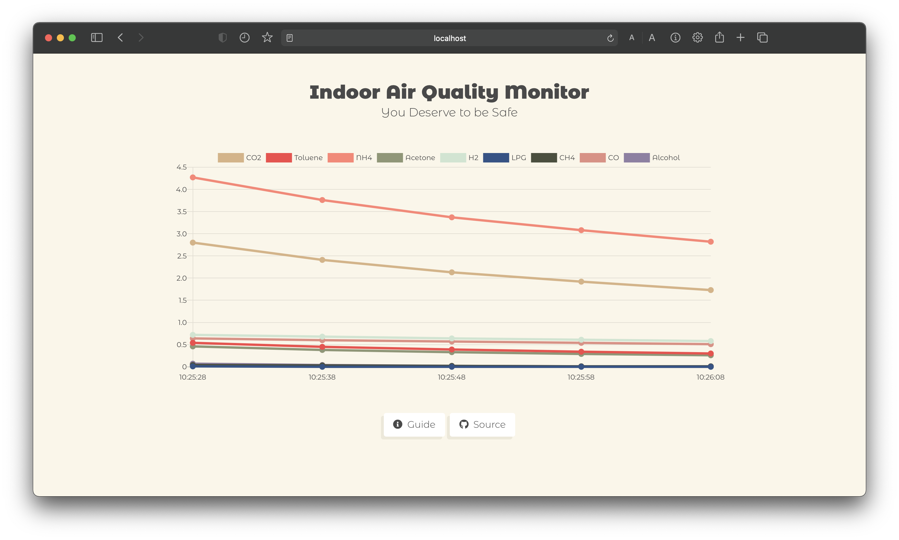

# IAQ Monitor Dashboard

**_An interactive dashboard for an IoT Indoor Air Quality (IAQ) monitoring system powered by Arduino Uno._**

> Data is fetched from the Arduino Uno and MQ sensors and is delivered through the back end https://github.com/anannya03/IAQ-Monitor-API.

  

## Getting Started

1. Setup project with `npm install`
2. Compile for development with `npm run serve`
3. Compile and minify for production with `npm run build`
4. Lint and fix files with `npm run lint`

## Customize Configuration

See [Configuration Reference](https://cli.vuejs.org/config/).

## Resources

- Styling with [Bulma.css](https://bulma.io/)
- Icons from [FontAwesome](https://fontawesome.com/)

## Contributing

Pull requests are welcome. For major changes, please open an issue first to discuss what you would like to change.
